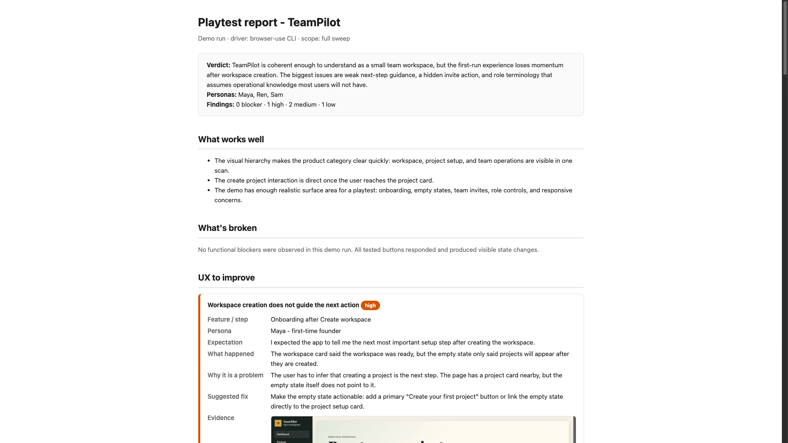
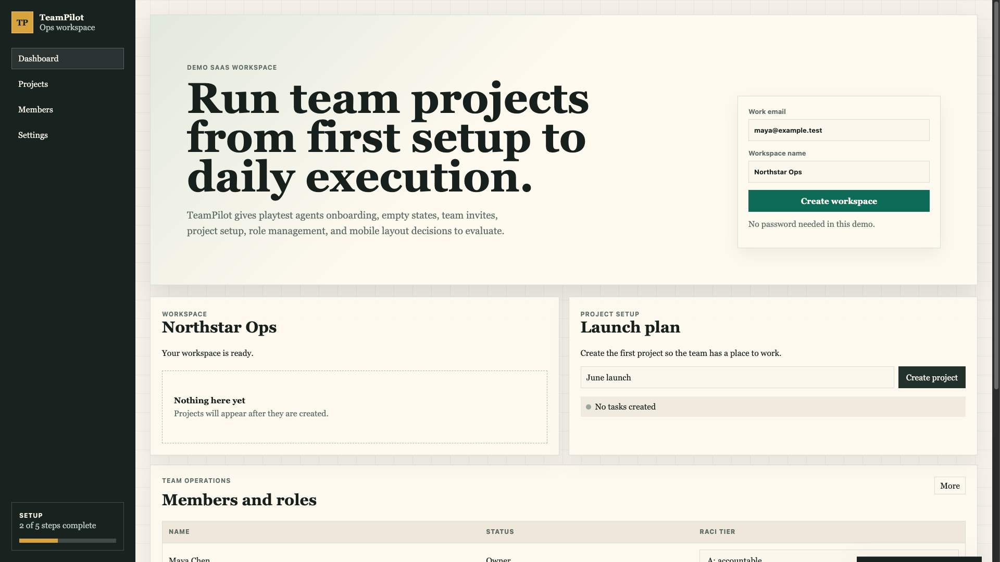

# Playtest Skill

[English](./README.md) | 简体中文

Playtest 是一个用于模拟真实目标用户做 UX 测试的 agent skill。它让 AI agent 像真实用户一样使用一个可运行的产品：先理解产品、推导 persona、通过浏览器或模拟器操作产品、记录第一人称反应，最后生成带截图证据的 UX 报告。

E2E 测试回答“产品是否能跑通”。Playtest 回答“用户是否知道该怎么做”。

## Demo 一眼看懂

这个 repo 包含一个故意不完美的 SaaS demo，以及基于它生成的 playtest 报告。





## 它解决什么问题

很多 AI 产品审查最后会变成代码审查或 bug list。Playtest 的重点不同：

1. 先读产品，整理完整 feature inventory。
2. 从产品本身推导目标用户 persona，而不是使用固定模板。
3. 写完 test plan 后停下来，让人选择测试 scope。
4. 通过本地浏览器或模拟器真实操作产品。
5. 用第一人称记录用户困惑，再转成结构化 UX finding。
6. 在 `docs/playtest/<date>/` 下生成带截图的 HTML 报告。

## 支持的 agent 入口

| Agent / 工具 | 入口文件 |
|---|---|
| Claude Code skills | `skills/playtest/SKILL.md` |
| Claude Code plugin | `.claude-plugin/plugin.json` |
| Codex / OpenAI coding agents | `AGENTS.md` |
| Claude 项目指令 | `CLAUDE.md` |
| Gemini 风格 agent | `GEMINI.md` |
| Cursor | `.cursor/rules/playtest.mdc` |
| 其他支持 instruction file 的 agent | 复制或合并 `AGENTS.md` |

## 支持的 driver

- Web via Playwright MCP
- Web via `browser-use` 或 Playwright CLI
- iOS via Xcode MCP / simulator tooling

## Claude Code Plugin 安装

在 Claude Code 里运行：

```text
/plugin marketplace add yangocean-sudo/playtest-skill
/plugin install playtest-skill@playtest-skill
```

CLI 方式：

```bash
claude plugin marketplace add yangocean-sudo/playtest-skill
claude plugin install playtest-skill@playtest-skill
```

## 使用方式

在产品 repo 里告诉 agent：

```text
Playtest this app as real target users and tell me what is confusing.
```

agent 应该先创建：

```text
docs/playtest/<YYYY-MM-DD>/test-plan.md
```

然后必须停下来，让你选择 scope。scope 确认后，它会继续生成：

```text
docs/playtest/<YYYY-MM-DD>/report.html
docs/playtest/<YYYY-MM-DD>/screenshots/
```

## Demo

这个 repo 包含一个故意不完美的小型 SaaS demo：TeamPilot。

运行：

```bash
npm run serve:demo
```

打开：

```text
http://localhost:4173
```

已提交的 playtest 示例输出在：

- [`docs/playtest/demo-teampilot/test-plan.md`](docs/playtest/demo-teampilot/test-plan.md)
- [`docs/playtest/demo-teampilot/report.html`](docs/playtest/demo-teampilot/report.html)
- [`docs/playtest/demo-teampilot/screenshots/00-report-overview.png`](docs/playtest/demo-teampilot/screenshots/00-report-overview.png)

这个 demo 技术上能跑通，但故意保留了真实产品常见 UX 问题：空状态没有下一步引导、邀请入口隐藏、角色术语难懂、移动端主操作不明显。

## 安全边界

只在本地或 disposable dev 环境运行。

不要对生产环境、真实客户数据、真实支付或真实邮件流程运行。这个 skill 可能会创建测试用户、点击页面、提交表单、上传文件并截图。

## License

MIT
